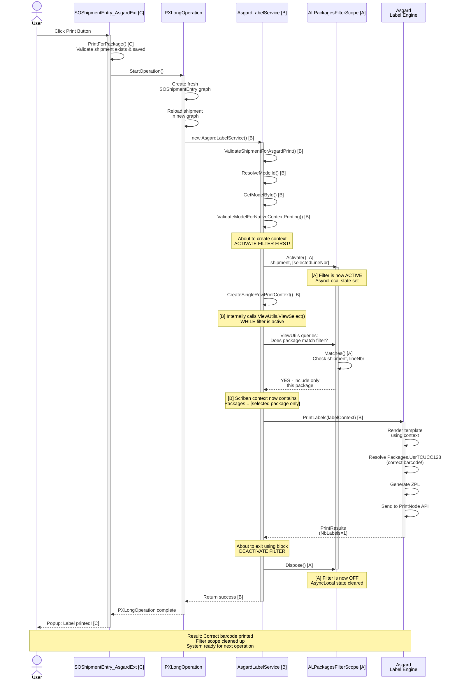

---

## **File Legend**

| Letter | Filename | Purpose |
|--------|----------|---------|
| **[A]** | `ALPackagesFilterScope.cs` | Thread-safe filter state management using AsyncLocal |
| **[B]** | `AsgardLabelService.cs` | Business logic for validation, model resolution, and print orchestration |
| **[C]** | `SOShipmentEntry_AsgardExt.cs` | PXGraphExtension that provides the Print button action and delegates to service |
| **[D]** | `SOShipmentEntry_ALPackagesFilterExt.cs` | PXGraphExtension that intercepts the ALPackages view and applies filtering |
| **[E]** | `SOShipmentEntry_ScanTriggerExt.cs` | PXGraphExtension that triggers printing when a package is confirmed (RowPersisted) |

---

## **How to Read This Diagram**

1. **Look at the legend** to identify which file each component comes from
2. **Follow the vertical lines** (lifelines) to see which component is active at each moment
3. **Follow the arrows** to see method calls flowing between components
4. **Read the note boxes** for key moments and state changes
5. **Letter annotations [A], [B], [C]** show which file is responsible for each action

---

## **File Responsibilities**

### **[A] ALPackagesFilterScope.cs**
- Manages the active filter state
- `Activate()` — Sets up the filter before print operations
- `Matches()` — Checks if a package matches the current filter
- `Dispose()` — Cleans up the filter when the operation ends
- **Key pattern**: Uses `AsyncLocal<>` for thread safety

### **[B] AsgardLabelService.cs**
- Validates the shipment and package
- Resolves which label model to use
- **Activates the filter scope** before creating the print context
- Passes the filtered context to Asgard for rendering
- **Key insight**: The filter must be active BEFORE context creation

### **[C] SOShipmentEntry_AsgardExt.cs**
- Provides the "Print Asgard Label" button
- `PrintForPackage()` method is the entry point
- Wraps the print operation in a `PXLongOperation` for background execution
- Creates a fresh graph instance to isolate the operation
- Delegates to `AsgardLabelService` for the actual work

### **[D] SOShipmentEntry_ALPackagesFilterExt.cs**
- Extends the SOShipmentEntry graph
- Replaces the `ALPackages` view's delegate with a filtered version
- `FilteredALPackages()` checks if each package matches the active filter
- **Called transparently** by Asgard's `ViewUtils.ViewSelect()`
- **Not explicitly called** in the main flow, but silently intercepts queries

### **[E] SOShipmentEntry_ScanTriggerExt.cs**
- **Not shown in this diagram** because it's not part of the button-click flow
- Provides automatic printing when a package is confirmed (scanned)
- `RowPersisted<SOPackageDetail>()` event handler
- Creates its own `PXLongOperation` and calls `PrintForPackage()` on a fresh graph

---

## **Key Points Illustrated**

1. **Filter Activation (Critical)**
   - [B] activates [A] BEFORE creating the context
   - This ensures [A]'s `Matches()` is called while views are being queried
   - Result: Only the selected package is included in the Scriban context

2. **The Silent Interception (Critical)**
   - [D] is never explicitly called in this flow
   - But it silently intercepts when Asgard's `ViewUtils.ViewSelect()` queries the graph
   - This is the mechanism that makes the filtering work transparently

3. **Filter Cleanup (Safety)**
   - [A]'s `Dispose()` is guaranteed to be called via the `using` statement
   - Restores the system to normal operation
   - Safe even if exceptions occur

4. **Thread Safety**
   - [A] uses `AsyncLocal<>` so each operation's filter is isolated
   - Multiple users can print labels simultaneously without interfering

5. **Single Responsibility**
   - [B] orchestrates but doesn't do the filtering
   - [A] does the filtering but doesn't know about printing
   - [C] provides the UI but delegates to [B]
   - [D] provides the interception point but is silent
   - [E] handles the scan/confirmation flow separately

---

## **Flow Summary**

```
User clicks button [C]
    ↓
PrintForPackage() [C] validates and creates fresh graph
    ↓
Calls AsgardLabelService [B]
    ↓
Service validates and resolves model [B]
    ↓
Service activates filter [A] ← CRITICAL MOMENT
    ↓
Service creates context [B] (internally queries views)
    ↓
Filtered view delegate [D] is called silently
    ↓
Matches() [A] checks and returns selected package only
    ↓
Context is populated with correct package data [B]
    ↓
Service calls Asgard to render and print
    ↓
Asgard uses filtered context → correct barcode prints
    ↓
Service deactivates filter [A] ← CLEANUP
    ↓
Filter is cleaned up, system returns to normal
    ↓
User sees success popup [C]
```

---

## **Why This Design Works**

The elegance of this solution is that:

1. **[A] provides a simple, thread-safe mechanism** for maintaining a global filter state
2. **[B] uses that mechanism** to ensure the context is created with filtered data
3. **[D] silently respects that mechanism** by delegating to it without needing explicit code
4. **[C] is blissfully unaware** of the filtering; it just calls the service
5. **[E] can reuse the same logic** for scan-triggered printing

All five files work together seamlessly, each with a clear responsibility and no circular dependencies.
