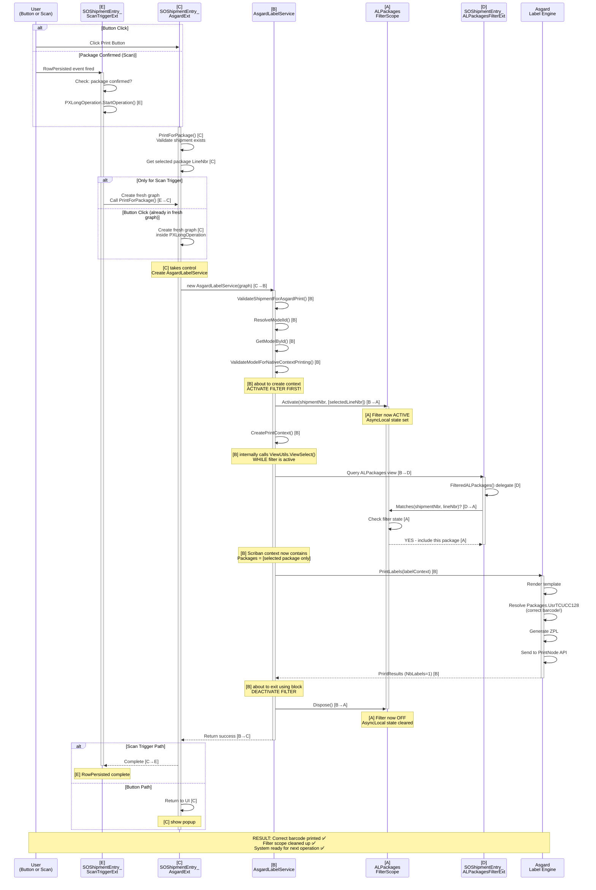

---

## **File Legend**

| Letter | Filename | Role |
|--------|----------|------|
| **[A]** | `ALPackagesFilterScope.cs` | Thread-safe filter state management using AsyncLocal. Provides Activate() and Matches() to control which packages are visible to views. |
| **[B]** | `AsgardLabelService.cs` | Business logic orchestrator. Validates shipment/model, **activates filter scope**, creates print context, calls Asgard. The strategic decision-maker. |
| **[C]** | `SOShipmentEntry_AsgardExt.cs` | PXGraphExtension providing the Print button UI action and PrintForPackage() method. Entry point for BOTH button and scan flows. Handles fresh graph creation and PXLongOperation. |
| **[D]** | `SOShipmentEntry_ALPackagesFilterExt.cs` | PXGraphExtension that silently intercepts ALPackages view queries and applies filtering based on active [A] scope. Called transparently by Asgard's ViewUtils.ViewSelect(). |
| **[E]** | `SOShipmentEntry_ScanTriggerExt.cs` | PXGraphExtension that detects when a package is confirmed (RowPersisted event). Creates fresh graph and delegates to [C].PrintForPackage(). Scan-trigger entry point only. |

---

## **How This Diagram Works**

### **Two Possible Entry Points (Both Converge at [C])**

1. **Button Click Path:**
   - User clicks "Print Asgard Label" button
   - Triggers [C].PrintForPackage() directly
   - [C] creates fresh graph and PXLongOperation

2. **Scan/Confirmation Path:**
   - Package is confirmed in WMS Pack Mode
   - [E] RowPersisted event fires
   - [E] creates fresh graph and calls [C].PrintForPackage() via FindImplementation
   - Both paths now identical

### **The Core Flow (Identical for Both Paths)**

1. **[C] Orchestrates** — Validates shipment, gets package, creates service
2. **[C] Creates [B]** — Hands off to business logic layer
3. **[B] Validates** — Checks shipment and model validity
4. **[B] Activates [A]** — **CRITICAL MOMENT** — Establishes filter state
5. **[B] Creates Context** — When Asgard queries views internally, [D] intercepts and filters
6. **[D] Queries [A]** — Silent interception: "Does this package match?"
7. **[A] Returns Match** — Yes/No decision controls what [D] yields
8. **[B] Passes to Asgard** — Template context now populated with correct package data
9. **Asgard Renders** — Uses filtered context → correct barcode prints
10. **[B] Deactivates [A]** — **CLEANUP** — Filter scope disposed, system returns to normal

### **Why the Filter Works**

- **[A]** is activated BEFORE [B] creates the print context
- **[D]** silently checks [A]'s state when views are queried
- When [A] is active and matches the selected package, only that package is yielded
- The Scriban context is populated with the filtered data
- Template renders with correct barcode
- No manual Packages collection modification needed

### **Why [D] is "Silent"**

- [D] is never explicitly called in this diagram
- It's automatically invoked because Asgard's `ViewUtils.ViewSelect()` queries the graph's views
- [D]'s `FilteredALPackages()` delegate intercepts that query
- This is the elegance: **transparent filtering without modifying the calling code**

### **Why Two Entry Points Converge**

Both [E] and button-click paths result in the same outcome:
- Fresh graph created
- [C].PrintForPackage() called with selected package LineNbr
- Everything else is identical

This convergence is intentional: **[C] is the single source of truth for print logic**. Both UI and scan automation delegate to it.

---

## **Key Architectural Insights**

### **Single Responsibility**
- **[A]**: Just manage state (filter on/off)
- **[B]**: Just do validation & orchestration
- **[C]**: Just handle UI and graph lifecycle
- **[D]**: Just intercept and delegate to [A]
- **[E]**: Just detect and delegate to [C]

### **Thread Safety**
- [A] uses `AsyncLocal<>` so each async operation has isolated filter state
- Multiple users printing simultaneously = no cross-contamination

### **Cleanup Guarantee**
- [B] wraps filter in `using` block
- [A]'s `Dispose()` guaranteed to be called
- Even if exception occurs, filter is cleaned up
- System returns to normal operation

### **Transparency**
- [D] doesn't know about [A] at design time
- At runtime, [D] queries [A] to make filtering decisions
- No explicit coupling; just a query-time lookup

### **Reusability**
- Button action [C] reuses same PrintForPackage() logic
- Scan trigger [E] reuses same PrintForPackage() logic
- No code duplication
- Changes to print logic only need one place (PrintForPackage)

---

## **Reading the Diagram: Step by Step**

1. **Start at the top** — Two possible paths (button vs scan)
2. **Both paths lead to [C]** — Convergence point
3. **Follow [C] → [B]** — Service creation and delegation
4. **Watch [B] activate [A]** — The critical filter activation moment
5. **See [B] → [D]** — Silent view query interception
6. **Watch [D] → [A]** — Filter check (does package match?)
7. **Watch [B] → Asgard** — Passing filtered context
8. **See Asgard render** — Using correct barcode from context
9. **Watch [B] deactivate [A]** — Cleanup/safety moment
10. **Result** — Correct barcode printed, filter cleaned up

---

## **Common Questions Answered by This Diagram**

**Q: Why does [E] call [C]?**
A: Both button and scan paths need identical logic. [C] is the single place where that logic lives. [E] creates a fresh graph and delegates to it.

**Q: Why doesn't [B] call [E]?**
A: [B] doesn't know about [E]. [E] is an event handler, not part of the business logic. [E] just detects and delegates.

**Q: Why doesn't [B] call [D]?**
A: [B] doesn't explicitly call [D]. When [B] calls `ViewUtils.ViewSelect()`, Asgard internally queries the graph's views, and [D] intercepts transparently.

**Q: What if the filter isn't activated?**
A: [A]'s `Matches()` returns false for all packages. [D] yields nothing. Context is empty. Asgard has no data to render. This prevents printing the wrong barcode.

**Q: What if [B] crashes before deactivating [A]?**
A: The `using` block ensures [A]'s `Dispose()` is called (C# finally block behavior). Filter is cleaned up even on exception.

**Q: Can [C] and [E] both run at the same time?**
A: Yes! [A] uses `AsyncLocal<>` so each async operation (each PXLongOperation) gets its own filter state. No interference.

---

## **Summary**

This **single comprehensive diagram** shows:
- ✅ How files interact with each other
- ✅ The convergence of two entry points at [C]
- ✅ The critical filter activation/deactivation moments
- ✅ The silent interception by [D]
- ✅ The thread-safe mechanism of [A]
- ✅ The orchestration logic of [B]
- ✅ The single source of truth in [C]

All five files are present, their interactions are clear, and the architecture's elegance is visible: **clean separation of concerns, transparent filtering, and reliable cleanup**.
